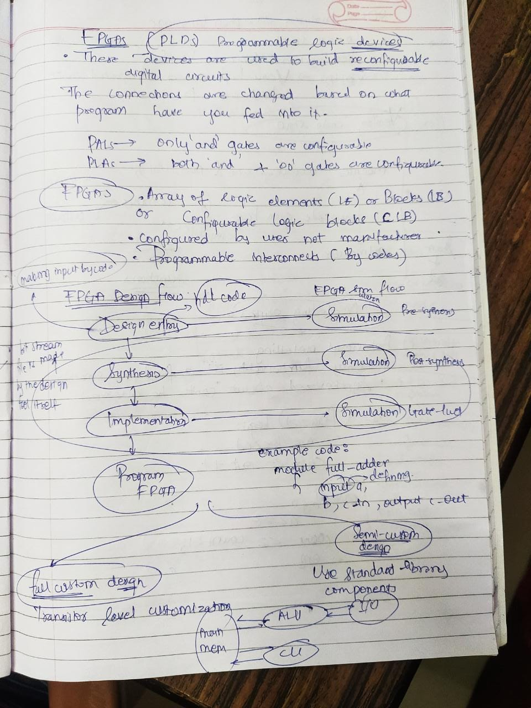

# FPGAs
FPGAs are Field Programmable Gate Arrays. As suggested by the name they are field configurable and can be used for variety of on-field operations.

## Key Features
* Gate Structure can be changed
* Use of HDL (Hardware description language)
* Can Run many parrallel operations all together at once with the help of multiple inputs and outputs channels
* Each structure of gates formed while programming is different and has very low chances of intersection

>### Notes:

